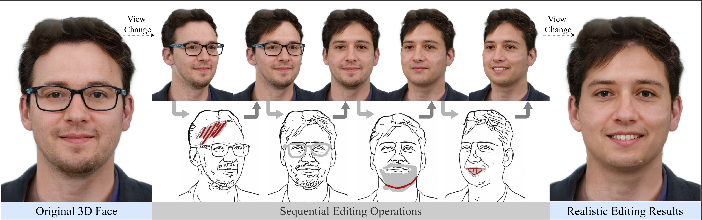

# [CVPR 2026 Highlight] SketchFaceGS: Real-Time Sketch-Driven Face Editing and Generation with Gaussian Splatting

<a href="http://arxiv.org/abs/2604.19202"></a>
<a href="https://huggingface.co/Junxiang123/SketchFaceGS_jittor"></a>
<a href="https://jittor.org"></a>

Official Jittor implementation of "SketchFaceGS: Real-Time Sketch-Driven Face Editing and Generation with Gaussian Splatting".



## Environment Set-up

Tested on Linux with Python 3.10 and an NVIDIA GPU.

```bash
git clone https://github.com/YOUR_USERNAME/SketchFaceGS_jittor.git
cd SketchFaceGS_jittor

conda create -n sketchfacegs python=3.10 -y
conda activate sketchfacegs

pip install -r requirements.txt
```

Then build the bundled JGaussian CUDA ops:

```bash
bash scripts/build_jgaussian.sh
```

## Weights

Download the main model checkpoint from [HuggingFace](https://huggingface.co/Junxiang123/SketchFaceGS_jittor):

```bash
bash scripts/download_weights.sh
```

This will place the checkpoint at `checkpoints/model.pkl`. All other required assets are bundled in the repository.

## Inference

### Gradio Demo

```bash
python app_addsketch_jittor.py --checkpoint checkpoints/model.pkl --port 7860
```

Then open `http://127.0.0.1:7860` in your browser.

### CLI Inference

```bash
python infer_jittor.py --checkpoint checkpoints/model.pkl
```

You can also use the wrapper script:

```bash
bash run_inference_jittor.sh
```

## Acknowledgements

Thanks to these great repositories:
[JGaussian](https://github.com/IGLICT/JGaussian),
[GGHead](https://github.com/tobias-kirschstein/gghead),
[LHM](https://github.com/aigc3d/LHM),
[Sketch Simplification](https://github.com/bobbens/sketch_simplification),
and many other inspiring works in the community.
